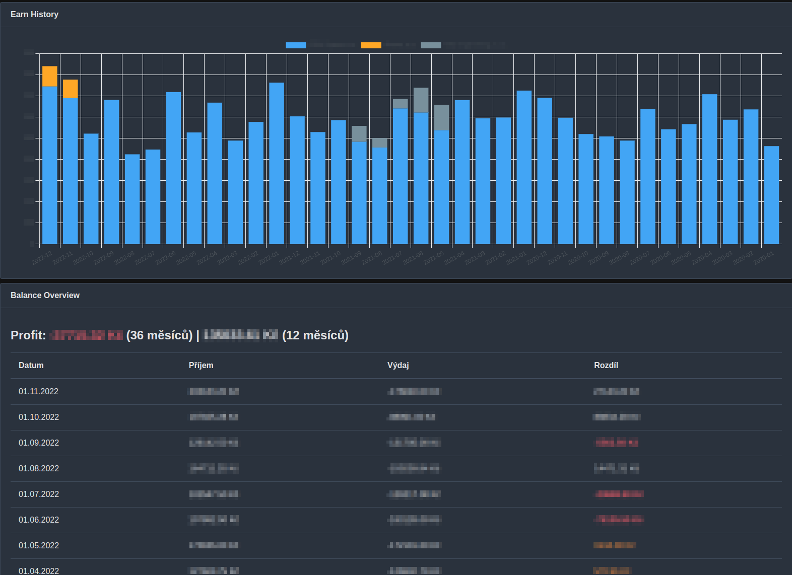

# Freelancer timesheet management

Manage your work log as freelancer. Write timesheet, manage projects, create invoice, track your money flow.

## Features
* Manage companies
* Manage projects
* Manage invoices
* Track money flow
* Manage timesheet
* Write your timesheet to remote systems (JIRA)

## Tech stack
* Kotlin
* Quarkus
* Vue + PrimeVue

